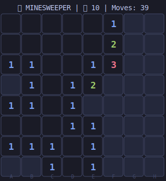

  
  <h1>Hi there, I'm Guidethegoofy! </h1>
  
  <h3>🚀 Full Stack Developer & AI Enthusiast</h3>
  
  

    Welcome to my digital playground. I build scalable applications, experiment with AI, and occasionally break production (for science).
  

<!-- MINESWEEPER:START -->

## 🎯 Minesweeper

**Click a cell coordinate below to reveal it!**

|   | A | B | C | D | E | F | G | H |
|---|---|---|---|---|---|---|---|---|
| **1** | · | · | 1 | [▪](https://github.com/Guidethegoofy/Guidethegoofy/actions/workflows/main.yml) | [▪](https://github.com/Guidethegoofy/Guidethegoofy/actions/workflows/main.yml) | [▪](https://github.com/Guidethegoofy/Guidethegoofy/actions/workflows/main.yml) | [▪](https://github.com/Guidethegoofy/Guidethegoofy/actions/workflows/main.yml) | [▪](https://github.com/Guidethegoofy/Guidethegoofy/actions/workflows/main.yml) |
| **2** | 1 | 1 | 3 | [▪](https://github.com/Guidethegoofy/Guidethegoofy/actions/workflows/main.yml) | [▪](https://github.com/Guidethegoofy/Guidethegoofy/actions/workflows/main.yml) | [▪](https://github.com/Guidethegoofy/Guidethegoofy/actions/workflows/main.yml) | [▪](https://github.com/Guidethegoofy/Guidethegoofy/actions/workflows/main.yml) | [▪](https://github.com/Guidethegoofy/Guidethegoofy/actions/workflows/main.yml) |
| **3** | [▪](https://github.com/Guidethegoofy/Guidethegoofy/actions/workflows/main.yml) | [▪](https://github.com/Guidethegoofy/Guidethegoofy/actions/workflows/main.yml) | [▪](https://github.com/Guidethegoofy/Guidethegoofy/actions/workflows/main.yml) | [▪](https://github.com/Guidethegoofy/Guidethegoofy/actions/workflows/main.yml) | [▪](https://github.com/Guidethegoofy/Guidethegoofy/actions/workflows/main.yml) | [▪](https://github.com/Guidethegoofy/Guidethegoofy/actions/workflows/main.yml) | [▪](https://github.com/Guidethegoofy/Guidethegoofy/actions/workflows/main.yml) | [▪](https://github.com/Guidethegoofy/Guidethegoofy/actions/workflows/main.yml) |
| **4** | [▪](https://github.com/Guidethegoofy/Guidethegoofy/actions/workflows/main.yml) | [▪](https://github.com/Guidethegoofy/Guidethegoofy/actions/workflows/main.yml) | [▪](https://github.com/Guidethegoofy/Guidethegoofy/actions/workflows/main.yml) | [▪](https://github.com/Guidethegoofy/Guidethegoofy/actions/workflows/main.yml) | [▪](https://github.com/Guidethegoofy/Guidethegoofy/actions/workflows/main.yml) | [▪](https://github.com/Guidethegoofy/Guidethegoofy/actions/workflows/main.yml) | [▪](https://github.com/Guidethegoofy/Guidethegoofy/actions/workflows/main.yml) | [▪](https://github.com/Guidethegoofy/Guidethegoofy/actions/workflows/main.yml) |
| **5** | [▪](https://github.com/Guidethegoofy/Guidethegoofy/actions/workflows/main.yml) | [▪](https://github.com/Guidethegoofy/Guidethegoofy/actions/workflows/main.yml) | [▪](https://github.com/Guidethegoofy/Guidethegoofy/actions/workflows/main.yml) | [▪](https://github.com/Guidethegoofy/Guidethegoofy/actions/workflows/main.yml) | [▪](https://github.com/Guidethegoofy/Guidethegoofy/actions/workflows/main.yml) | [▪](https://github.com/Guidethegoofy/Guidethegoofy/actions/workflows/main.yml) | [▪](https://github.com/Guidethegoofy/Guidethegoofy/actions/workflows/main.yml) | [▪](https://github.com/Guidethegoofy/Guidethegoofy/actions/workflows/main.yml) |
| **6** | [▪](https://github.com/Guidethegoofy/Guidethegoofy/actions/workflows/main.yml) | [▪](https://github.com/Guidethegoofy/Guidethegoofy/actions/workflows/main.yml) | [▪](https://github.com/Guidethegoofy/Guidethegoofy/actions/workflows/main.yml) | [▪](https://github.com/Guidethegoofy/Guidethegoofy/actions/workflows/main.yml) | [▪](https://github.com/Guidethegoofy/Guidethegoofy/actions/workflows/main.yml) | [▪](https://github.com/Guidethegoofy/Guidethegoofy/actions/workflows/main.yml) | [▪](https://github.com/Guidethegoofy/Guidethegoofy/actions/workflows/main.yml) | [▪](https://github.com/Guidethegoofy/Guidethegoofy/actions/workflows/main.yml) |
| **7** | [▪](https://github.com/Guidethegoofy/Guidethegoofy/actions/workflows/main.yml) | [▪](https://github.com/Guidethegoofy/Guidethegoofy/actions/workflows/main.yml) | [▪](https://github.com/Guidethegoofy/Guidethegoofy/actions/workflows/main.yml) | [▪](https://github.com/Guidethegoofy/Guidethegoofy/actions/workflows/main.yml) | [▪](https://github.com/Guidethegoofy/Guidethegoofy/actions/workflows/main.yml) | [▪](https://github.com/Guidethegoofy/Guidethegoofy/actions/workflows/main.yml) | [▪](https://github.com/Guidethegoofy/Guidethegoofy/actions/workflows/main.yml) | [▪](https://github.com/Guidethegoofy/Guidethegoofy/actions/workflows/main.yml) |
| **8** | [▪](https://github.com/Guidethegoofy/Guidethegoofy/actions/workflows/main.yml) | [▪](https://github.com/Guidethegoofy/Guidethegoofy/actions/workflows/main.yml) | [▪](https://github.com/Guidethegoofy/Guidethegoofy/actions/workflows/main.yml) | [▪](https://github.com/Guidethegoofy/Guidethegoofy/actions/workflows/main.yml) | [▪](https://github.com/Guidethegoofy/Guidethegoofy/actions/workflows/main.yml) | [▪](https://github.com/Guidethegoofy/Guidethegoofy/actions/workflows/main.yml) | [▪](https://github.com/Guidethegoofy/Guidethegoofy/actions/workflows/main.yml) | [▪](https://github.com/Guidethegoofy/Guidethegoofy/actions/workflows/main.yml) |

📊 **Moves:** 6 | 💣 **Mines:** 10 | 🚩 **Flags:** 0

> 💡 **How to play:** Go to [Actions](https://github.com/Guidethegoofy/Guidethegoofy/actions) → "Minesweeper Game" → "Run workflow" → Enter cell (e.g., A1)

<!-- MINESWEEPER:END -->

 

## 🛠️ Tech Stack

  
  
  
  
  
  

 

## 📊 GitHub Stats

  
  

 

## 🧩 About Me

<table>
  <tr>
    <td width="60%">
      <ul>
        <li>🔭 I'm currently working on <strong>[Project Name]</strong></li>
        <li>🌱 I'm currently learning <strong>Advanced AI Agent Design</strong></li>
        <li>👯 I'm looking to collaborate on <strong>Open Source Projects</strong></li>
        <li>💬 Ask me about <strong>Python, Web Dev, and Anime</strong></li>
        <li>📫 How to reach me: <strong>[Your Email]</strong></li>
        <li>⚡ Fun fact: <strong>That plane shooter animation above? I made it!</strong></li>
      </ul>
    </td>
    <td width="40%" align="center">
       
    </td>
  </tr>
</table>

  

